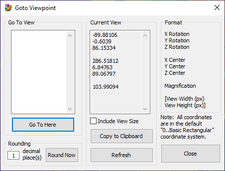

# Femap Viewpoint
Lightweight program for listing and reloading basic view data.

See [How to use Femap Scripts](https://github.com/aaronjasso/How_to_use_Femap_Scripts) if you're unfamiliar with how to run a macro program

This program will display basic model position, orientation, and magnification data (and optionally view window size) for your current FEM view. This makes it easy to return to a known view of your model, provided you saved the view information somewhere.

This is useful for updating reports, presentations, or spreadsheets where you may have things like arrow leaders or text boxes positioned precisely over an FEM picture that needs to be updated. Being able to copy the _exact_ same view angle means you won't have to move any leaders or textboxes or any other separate entities that rely on the figure. It's also useful for returning to a useful orientation within Femap after some operation elsewhere. The view data is stored as plaintext. When making reports in Microsoft Word, I store the view data with my FEM pictures in the ALT TEXT section.

>NOTE: the term 'view' used in this document is not the same as a Femap View. The view data used by this program is much more limited than a Femap View. It is also not incorporated into the model file in any way.

### The User Interface


##### Current View
 The current parameters of the view in the active Femap window are shown here. As stated in the **format** section, the view data is displayed as:
 ```
 X Rotation
 Y Rotation
 Z Rotation
 
 X Center
 Y Center
 Z Center
 
 Magnification
 
 [View Window Width] Optional
 [View Window Height] Optional
 ```
 
**Include View Size checkbox** will add the width and height of the active view window (in pixels) to the data. This is done in a roundabout way due to an omission in the Femap API. It takes some time for larger views (a few seconds), and is therefore not enabled by default. It also prints an unavoidable message to the message window which may be ignored. See the note on this method at the end of this document.

**Copy to Clipboard** copies the contents of the _Current View_ section to the clipboard. After the data is copied, the dialog box is closed.

The data in the clipboard can be used to return to the viewpoint it describes.

**Refresh** updates the _Current View_ data if the model is moved while the dialog box is open (as is possible with a Spaceball or similar input device).

#### Rounding
The data defaults to five decimal places of precision. This can be unwieldy or unnecessary, so there's an option to round the data into a desired precision.

The **Round Now** button will update the _Current View_ window with the number of decimal places specified in the _decimal place(s)_ input box. The actual view window containint the model is also updated.

### Go To View
Pasting previous viewpoint data into the input box and clicking _Go To Here_ will return the active Femap window to the view described by the data. The ability to return to a previously used view is the main purpose of this program.

### Notes

**View Size**
As of Femap 2019.1, there's not an API call to get the size of the active view. To get around this, I use a hack that involves saving a bitmap of the active view, interrogating the bitmap header to get the size, and then deleting the bitmap.

This requires use of the `feFilePictureSave2` API function which writes "Picture Save to Image Complete.  Image File: FemapTempPic.bmp" to the message window. This message is unnecessary and potentially confusing, but I haven't found a way to prevent it.

This hack also relies on the %TEMP% environmental variable, and has only been tested on Windows systems. On other platforms, the _Include View Size_ option may not work.